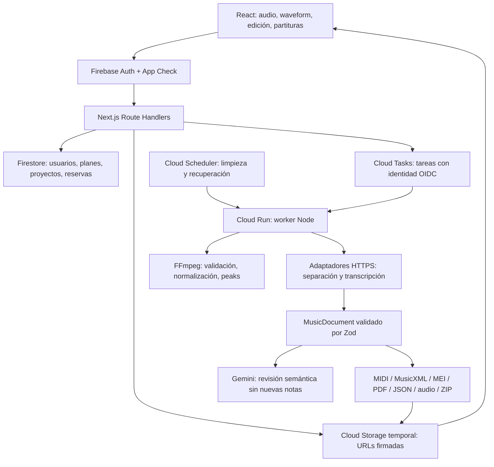

# AudioScore AI — arquitectura y decisiones

## Alcance construido

Aplicación Next.js App Router, React y TypeScript estricto. El estudio local transcribe archivos reales sin cuenta ni credenciales: Basic Pitch detecta notas polifónicas y YAMNet estima instrumentos probables, ejecutados con TensorFlow.js/WASM en un Web Worker. Los modelos se sirven desde `public/models/`, sin llamar a un servicio de inferencia externo. El worker Node reutiliza la misma inferencia en un hilo aislado. El SaaS usa Firebase Auth, Firestore, App Check, Admin, Storage temporal y Cloud Tasks. La separación en stems instrumentales requiere un motor adicional; la transcripción externa es una extensión opcional.

## ADR 001 — un código base, dos responsabilidades

**Decisión:** frontend, APIs y worker pertenecen a esta aplicación Next.js. Cloud Run puede ejecutar la misma imagen en un servicio público y otro reservado al procesamiento. No se introduce un backend Python ni un segundo esquema de persistencia.

**Alternativas:** ejecutar procesamiento dentro de la petición del navegador simplifica despliegue pero impide reintentos seguros; un microservicio independiente incrementa contratos y operación. La cola mantiene independientes los tiempos del navegador y del worker. El coste es configurar IAM, Tasks, Storage y Scheduler.

**Revisión:** separar la imagen del worker si el tamaño de dependencias de notación o las necesidades de GPU lo justifican. El contrato de los adaptadores permanece igual.

## ADR 002 — eventos musicales como fuente de verdad

`lib/music/types.ts` define `MusicDocument`, fuentes, tempo map, secciones y eventos. PPQ=128 coincide con MidiWriterJS. Los ticks son la coordenada editable; los segundos se recalculan al editar. El proveedor debe entregar ambos de forma consistente. Las conversiones integran todos los cambios de tempo. MIDI importado se convierte desde su resolución original.

La vista legible cuantiza **una copia**. La operación explícita Cuantizar sí modifica el documento con historial. Los archivos se generan desde una revisión congelada para impedir que una edición posterior cambie una exportación en ejecución.

MusicXML asigna voces sin solapamientos, añade silencios para completar compases y divide notas entre compases con ligaduras. La validación implementada es estructural y de invariantes musicales, **no es una certificación XSD MusicXML/MEI ni una revisión musical perfecta**. Tuplets explícitos, transposición de instrumentos, notación de batería avanzada y automatización siguen pendientes. MIDI con pitch bend o automation se rechaza para evitar pérdida silenciosa.

## ADR 003 — motores de audio separados de Gemini

**Decisión:** los modelos integrados producen activaciones de notas e instrumentos; los adaptadores opcionales pueden aportar motores adicionales y separación. Gemini solo revisa el documento estructurado. No puede añadir notas, cambiar pitches ni inventar fuentes. El esquema limita su salida a resumen, advertencias e IDs existentes.

La identificación acústico/eléctrico/electrónico conserva niveles de confianza y procedencia. La procedencia analógica/digital debe ser `unknown` en la respuesta de un proveedor: una grabación por sí sola no establece el hardware utilizado.

**Coste:** el motor integrado requiere CPU/memoria del equipo del usuario o del worker Node; no se necesita contratar un proveedor para la transcripción base. La separación por instrumentos y los motores alternativos requieren integración adicional. Se limita cada inferencia integrada a 15 minutos y 10 000 notas, con ventanas de 12 segundos y contexto de un segundo. Las asignaciones de memoria TensorFlow se liberan por ventana y la cancelación termina el worker.

El modelo de notas no atribuye sus notas a los instrumentos detectados por YAMNet. Se conserva una pista de mezcla transcrita; la identificación probable se muestra por separado. No se crean stems ficticios. El tempo se estima por autocorrelación de cambios de energía y la tonalidad por distribución de clases de altura. El compás no se detecta: 4/4 se presenta como rejilla inicial para revisar. Todas las notas automáticas conservan `isHumanReviewed: false`; las activaciones no se presentan como probabilidades calibradas.

## Firestore

| Ruta                                 | Propósito                                                            | Escritor                      |
| ------------------------------------ | -------------------------------------------------------------------- | ----------------------------- |
| `/users/{uid}`                       | Estado, plan, contador de proyectos y jobs activos                   | Admin SDK                     |
| `/users/{uid}/projects/{id}`         | Metadatos, estado y documento musical canónico                       | APIs/worker                   |
| `.../jobs/{jobId}`                   | Etapa, progreso, intentos, bloqueo, formato, snapshot de exportación | Cola/worker                   |
| `.../corrections/{id}`               | Operación, usuario y referencias before/after                        | API de correcciones           |
| `.../scoreRevisions/{id}`            | Snapshots para undo/redo                                             | API de correcciones           |
| `.../exports/{id}`                   | Archivo, formato, revisión y caducidad                               | Worker                        |
| `/users/{uid}/usage/{id}`            | Reserva, confirmación o liberación                                   | Transacción                   |
| `/users/{uid}/usageMonths/{YYYY-MM}` | Totales del mes UTC                                                  | Transacción                   |
| `/plans/{id}`                        | Límites y features                                                   | Inicialización/administración |
| `/subscriptions/{id}`                | Espacio reservado para la integración de facturación                 | Backend de facturación futuro |
| `/temporaryAssets/{sha256(path)}`    | Inventario para limpieza idempotente                                 | APIs/worker                   |
| `/rateLimits/{hash}`                 | Contadores de peticiones, TTL                                        | API                           |
| `/adminLogs/{id}`                    | Auditoría administrativa y borrado                                   | APIs/limpieza                 |
| `/system/config`                     | Configuración informativa del sistema                                | Inicialización                |

Fuentes, eventos y secciones permanecen dentro del documento canónico. No se mantienen copias divergentes en subcolecciones. Límite conservador: 700 KB por documento/snapshot; máximo 10 000 eventos en el esquema, sujeto a ese límite. Documentos grandes requieren procesamiento regional. Escalar a chunks o documentos de eventos requerirá una migración explícita; no se oculta el límite de Firestore.

Correcciones referencian snapshots separados para evitar exceder 1 MiB al almacenar before y after juntos. El historial visible tiene 50 pasos. Las reservas conservan el mes de creación para confirmar correctamente si el job cruza de mes.

## Seguridad

- Firebase Client autentica; Admin verifica cookies de sesión revocadas y claims.
- El UID se obtiene exclusivamente de la sesión; no hay parámetro userId para acceso privado.
- APIs privadas verifican App Check en todas las solicitudes y Origin exacto en mutaciones.
- Claims `admin: true` definen administración; el campo role del cliente nunca concede permisos.
- Se comprueban correo verificado, estado de cuenta y suscripción.
- Reglas Firestore: lectura del propietario activo o admin; todas las escrituras del navegador se deniegan. Todas las mutaciones pasan por APIs.
- Reglas Storage: acceso directo denegado. Se utilizan URLs firmadas breves con paths por usuario/proyecto.
- Worker: secreto de al menos 32 caracteres + OIDC firmado, audiencia y email de la cuenta de servicio.
- APIs validan Zod; FFmpeg recibe rutas temporales controladas, nunca comandos del usuario.
- El upload se valida por MIME, tamaño, duración y generación del objeto; el worker descarga la generación validada para evitar sustitución después de reservar.
- Procesamiento usa bloqueos con token; finalizaciones tardías no pueden confirmar trabajos cancelados ni cobrar dos veces.
- Claves privadas y Gemini solo existen en módulos server-only.

## Consumo y cola

Una transacción lee usuario, proyecto, balance mensual y job por clave. Verifica límites y reserva duración obtenida del servidor. Una solicitud duplicada devuelve el job existente; cambiar sus parámetros con la misma clave produce 409. Finalización confirma la reserva una vez; fallo/cancelación la libera una vez. El contador de jobs se actualiza con la reserva y la finalización.

Se persiste el job **antes** de llamar a Tasks. Scheduler recupera jobs que no pudieron despacharse. El nombre de la tarea es determinista. Reintentos del worker conservan la reserva y generan paths deterministas; tras tres intentos se falla y libera. El reintento administrativo crea una nueva operación y nueva reserva, respetando el plan actual. Prioridad y batch están modelados en los planes; las colas de prioridad y la UI de batch todavía no se implementan.

## Retención

Original, working, stems, WAV/MP3 y ZIP: máximo 24 h. MIDI/MusicXML/MEI/PDF/JSON: el menor entre retención del plan y 7 días. `temporaryAssets` gobierna la limpieza programada y su auditoría. Las URLs de lectura duran como máximo 5 minutos y nunca superan la expiración del archivo. Un archivo borrado conserva metadatos musicales; la API devuelve 410 si se solicita después de caducar.

La política de ciclo de vida de 8 días es un respaldo, no sustituye la limpieza por hora/minuto. Debe configurarse Scheduler para el límite de 24 h. GCS Soft Delete y versionado deben deshabilitarse en este bucket dedicado si se necesita eliminación efectiva inmediata.

## Dependencias adicionales justificadas

`google-auth-library`: validar la identidad OIDC de Tasks. `fast-xml-parser`: validar/parsing estructural de MusicXML. `pdfkit` y `svg-to-pdfkit`: Verovio produce SVG/MEI, no un PDF listo desde su API WASM; estas librerías convierten la misma notación SVG a PDF. `fflate`: compresión ZIP sin introducir un segundo motor musical. `server-only`: impide importar secretos desde componentes de navegador.

## Referencias técnicas

- [Next.js App Router](https://nextjs.org/docs/app)
- [Sesiones Firebase](https://firebase.google.com/docs/auth/admin/manage-cookies)
- [Verificación App Check](https://firebase.google.com/docs/app-check/custom-resource-backend)
- [Cloud Tasks con OIDC](https://docs.cloud.google.com/tasks/docs/creating-http-target-tasks)
- [Gemini Structured Output](https://ai.google.dev/gemini-api/docs/structured-output)
- [WaveSurfer](https://wavesurfer.xyz/docs/)
