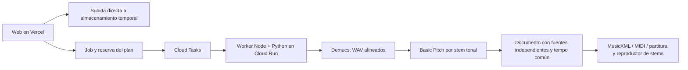

# Separación real y despliegue — 8 de octubre de 2026

La web continúa en Next.js/TypeScript. El worker de audio usa Python 3.11, PyTorch y Demucs 4.0.1 para producir WAV separados; después ejecuta Basic Pitch sobre cada stem tonal. No requiere una API comercial. Python se añade al worker, no al navegador ni al despliegue web de Vercel.

## Recorrido implementado



- `SEPARATION_ENGINE=demucs` activa el motor solo en el worker externo. La llamada HTTPS opcional `SEPARATION_PROVIDER_URL` sigue disponible para reemplazarlo.
- Hasta seis categorías: voz, batería, bajo, otros, guitarra y piano (`htdemucs_6s`). Para planes que admiten cuatro o cinco fuentes, se usa `htdemucs`: voz, batería, bajo y otros. El límite de fuentes nunca se elude descartando arbitrariamente canales de una mezcla.
- Canales casi silenciosos se omiten. Los canales con energía útil menor a −30 dB respecto del original se conservan como audio, pero no se transcriben automáticamente: el modelo de notas puede amplificar filtraciones débiles. El RMS se mide sin componente continua. Este umbral es una heurística conservadora y puede omitir instrumentos suaves reales; no demuestra su ausencia. La energía no es una probabilidad de presencia. Las etiquetas del separador son estimaciones; se conserva procedencia acústica/electrónica y analógica/digital desconocida.
- Cada WAV conserva 44.1 kHz, estéreo, duración y origen temporal comunes. Si hace falta evitar clipping se aplica la misma ganancia a todos, sin normalizar cada canal de forma independiente.
- Los archivos se guardan bajo `temporary/UID/PROJECT/stems/JOB/`, se registran para limpieza y tienen caducidad máxima de 24 horas o la del original si es anterior.
- El worker verifica propiedad, tamaño, decodificación, señal y duración de cada archivo. La transcripción tonal se asigna a su fuente real; las notas de la mezcla no se duplican en los canales.
- El tempo/compás/tonalidad globales se comparten. Los ticks se recalculan desde los tiempos reales de cada stem; no se estima un tempo diferente para cada instrumento.
- Batería: stem real reproducible, sin notas fabricadas. Sigue pendiente incorporar un transcriptor específico de percusión.
- «Otros sonidos» es una mezcla residual, no un sintetizador aislado ni un instrumento identificado con certeza.
- Reprocesar una región de un documento con stems requiere un proveedor compatible. El motor integrado pide reanalizar el audio completo para evitar atribuir todas las notas de la mezcla a una sola pista.
- El motor admite hasta 15 minutos de audio. Separación: máximo 15 minutos de ejecución; cada transcripción: hasta 12 minutos; presupuesto de separación/transcripción del job: 27 minutos. Puede requerir audio más corto en CPU. La lease dura 30 minutos y Cloud Tasks tiene deadline de 30 minutos; reservar margen para validación/exportación sigue siendo necesario.

## Desarrollo local, sin activar facturación cloud

Usar un entorno Python aislado. No instalar PyTorch en el Python global:

```powershell
uv venv --python 3.11 .tmp/separator-venv
uv pip install --python .tmp/separator-venv/Scripts/python.exe torch==2.6.0 torchaudio==2.6.0 --index-url https://download.pytorch.org/whl/cpu
uv pip install --python .tmp/separator-venv/Scripts/python.exe -r services/separator/requirements.txt
```

El CLI acepta un WAV estéreo a 44.1 kHz, preparado con FFmpeg. Ejemplo:

```powershell
.tmp/separator-venv/Scripts/python.exe services/separator/separate.py --input normalized.wav --output separated --model htdemucs_6s --device cpu
```

Devuelve JSON por stdout y WAV reales en la carpeta indicada. La primera ejecución descarga los pesos oficiales. En la imagen de producción ambos modelos se descargan durante la construcción, no dentro de una petición de usuario.

La prueba local del separador no depende de Firebase ni implica publicar el worker. El estudio de navegador conserva su transcripción local; no puede ejecutar este modelo pesado ni activar stems sin el backend cloud configurado.

## Prueba real realizada

Se procesaron 12 segundos del audio proporcionado «Alan Walker - Faded - Piano Tutorial.mp3» en el equipo local, usando los pesos reales del modelo de seis categorías y luego el motor integrado de notas. Con el modelo ya descargado, la separación tardó 50.9 s y el recorrido completo, con transcripción y MusicXML/MIDI/SVG, 65.9 s. Estos tiempos no son una promesa para Cloud Run ni para canciones completas.

El manifiesto final incluyó cinco WAV alineados: piano, guitarra, otros sonidos, bajo y batería; voz se omitió por señal casi silenciosa. Se escribieron 57 eventos en piano, 21 en guitarra estimada y 12 en el canal residual. Bajo quedó sin notas por señal débil y batería sin transcripción automática. Estos números no certifican la existencia de guitarra/bajo/batería en un tutorial de piano: el separador puede colocar filtraciones en esas categorías. El resultado necesita escucha y comparación musical; no se ha certificado contra el PDF original.

La integración, timing, exportaciones e identidad cloud pasaron 39 comprobaciones automatizadas. La prueba real fue local y no hizo llamadas a un proveedor comercial ni publicó audio en Google Cloud. El flujo completo con cola/bucket/worker de producción sigue pendiente de activar y verificar. La imagen Docker se prepara en el repositorio; su compilación y despliegue se verifican al habilitar ese entorno.

## Publicación propuesta

1. Mantener `audioscore.vercel.app` en Vercel, con el código web actual. Vercel Pro no incluye los costes de Google Cloud.
2. Construir el target de Docker `audio-worker` del repositorio: `docker build --target audio-worker -t audioscore-audio-worker .`. El target final `runner` sigue siendo la imagen web ligera.
3. Publicar la imagen en Artifact Registry y desplegar Cloud Run, inicialmente CPU, 4 vCPU / 8 GiB, concurrencia 1, máximo 1 instancia, mínimo 0, timeout 1800 s. Son parámetros iniciales a medir con canciones completas; no una capacidad garantizada. Para escalado/latencia exigentes evaluar GPU con una imagen CUDA; la imagen incluida usa ruedas CPU y no habilita CUDA por cambiar una variable.
4. Crear una cuenta de servicio del worker con acceso limitado a Firestore y al bucket temporal. Usar identidad del servicio (ADC), sin archivos de clave en GitHub o la imagen. Conservar validación OIDC + secreto interno de al menos 32 caracteres del handler existente.
5. Crear Cloud Tasks, cuenta invocadora, permisos de invocación del servicio, cola con concurrencia inicial 1 y reintentos limitados. Configurar `CLOUD_TASKS_QUEUE`, `CLOUD_TASKS_LOCATION`, `CLOUD_TASKS_SERVICE_ACCOUNT`, `GOOGLE_CLOUD_PROJECT_ID`, `GOOGLE_CLOUD_STORAGE_BUCKET`, `WORKER_URL` e `INTERNAL_JOB_SECRET` en Vercel y/o worker según su función. `WORKER_URL` y la audiencia OIDC deben coincidir exactamente. Storage y Cloud Tasks reutilizan la identidad federada actual de Vercel; añadirle acceso limitado al bucket, creación de tareas y `iam.serviceAccounts.actAs` sobre la identidad invocadora. La firma de URLs por IAM requiere `iam.serviceAccounts.signBlob` sobre la cuenta firmante. Los roles actuales de Auth/Firestore por sí solos no conceden estas capacidades.
6. En el worker: `FIREBASE_PROJECT_ID=audioscore-ca277`, `SEPARATION_ENGINE=demucs`, `PYTHON_PATH=/opt/separator/bin/python`, `DEMUCS_MODEL=htdemucs_6s`, `DEMUCS_DEVICE=cpu`. No configurar `TRANSCRIPTION_PROVIDER_URL` para usar la transcripción integrada por stem.
7. Verificar CORS del bucket para reproducción desde la web, caducidad/limpieza existentes y un plan de AudioScore con separación habilitada. Free no incluye separación; Starter tiene cuatro fuentes; Pro permite seis. El plan AudioScore y Vercel Pro son conceptos distintos.
8. Probar un job real desde una cuenta autorizada: WAV accesibles, solo/mute, notas propias por pista, MusicXML con partes independientes, cancelación, reintentos, cuotas y eliminación temporal. Solo entonces considerar activación pública.

No se ha activado facturación ni desplegado este worker cloud. Usar Cloud Run en el mismo proyecto requiere enlazar una cuenta de facturación y cambia Firebase de Spark a Blaze. Cloud Storage para Firebase también requiere Blaze desde febrero de 2026. Esta decisión contradice la preferencia anterior de conservar el plan gratuito y requiere autorización del propietario.

## Vercel Pro: ventajas y límites

| Opción | Ventajas | Desventajas |
| --- | --- | --- |
| Separación en funciones Python de Vercel | Un proveedor para web y ejecución; útil para pruebas cortas en CPU | Sin GPU nativa; máximo 4 GB / 2 vCPU; arranques con modelos pesados; límites de duración y memoria; subida de canciones debe evitar el cuerpo de la función |
| Vercel + worker Cloud Run (implementación elegida) | Modelos fuera del bundle web; recursos configurables; cola, reintentos y avance del job; posibilidad futura de GPU | Dos despliegues; coste de cómputo, almacenamiento y transferencia adicional; IAM y cola; latencia de arranque y operación del worker |
| Worker local | Permite medir calidad sin contratar cómputo cloud | Depende de mantener el equipo encendido; no es un backend público de producción |

Con Fluid Compute, Pro tiene máximo general de 800 segundos por función y ampliación beta a 1800 segundos en runtimes compatibles. El cuerpo de petición/respuesta mantiene límite de 4.5 MB. Hay una beta de bundles grandes de hasta 5 GB; eso no añade GPU ni RAM y no elimina el coste de cargar y ejecutar el modelo. Por eso la separación pesada no se coloca dentro del despliegue web.

Demucs es una base disponible, no una garantía de separar cualquier instrumento. Su modelo de seis fuentes es experimental y el propio proyecto advierte filtraciones/artefactos en piano. El repositorio original está archivado; se fija la versión para tener una base reproducible y el adaptador permite sustituir el motor. No diferencia piano acústico/eléctrico o sintetizador analógico/digital de forma concluyente. La calidad debe medirse con referencias y escuchas, especialmente antes de prometer partituras comerciales fieles.

Fuentes oficiales: [Demucs](https://github.com/facebookresearch/demucs), [Basic Pitch](https://github.com/spotify/basic-pitch), [límites de Vercel](https://vercel.com/docs/functions/limitations), [Vercel y GPU](https://vercel.com/i/what-is-serverless-gpu), [GPU en Cloud Run](https://cloud.google.com/run/docs/configuring/services/gpu), [planes Firebase](https://firebase.google.com/docs/projects/billing/firebase-pricing-plans), [requisito Blaze para Storage](https://firebase.google.com/docs/storage/faqs-storage-changes-announced-sept-2024).
